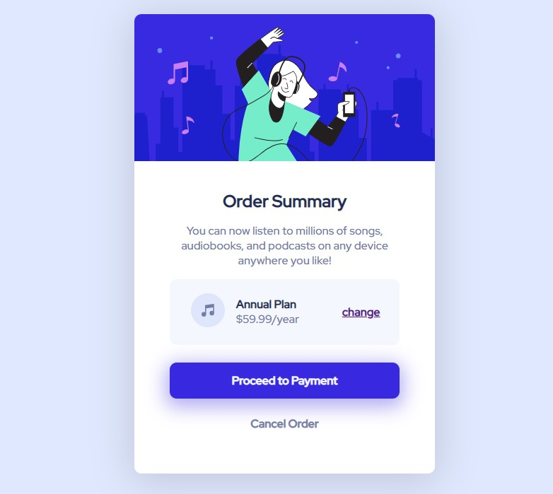

# Frontend Mentor - NFT preview card component solution

This is a solution to the [NFT preview card component challenge on Frontend Mentor](https://www.frontendmentor.io/challenges/nft-preview-card-component-SbdUL_w0U). Frontend Mentor challenges help you improve your coding skills by building realistic projects. 

## Table of contents

- [Overview](#overview)
  - [The challenge](#the-challenge)
  - [Screenshot](#screenshot)
- [Links](#links)
- [Built with](#built-with)
- [Author](#author)
- [Acknowledgments](#acknowledgments)


### The challenge

Users should be able to:

- View the optimal layout depending on their device's screen size
- See hover states for interactive elements

### Screenshot



### Links

- Live Site URL: [Page Link](https://xulab5.github.io/order-summary-v1/)

### Built with

- Semantic HTML5 markup
- CSS custom properties
- Flex Box

To see how you can add code snippets, see below:

```html
  <div class="card" >
    
    <div class="card-body">
      <h2 class="card-title">Order Summary</h2>
      <p class="card-text">  You can now listen to millions of songs, audiobooks, and podcasts on any device anywhere you like!</p>
      <section class="plan">
        <div class="music-icon">
          
        </div>
        <div class="annual-plan"> 
          <span>Annual Plan</span> 
          <span>$59.99/year</span>
        </div>
        <div>
          <a href="#" class="change-btn">change</a>
        </div>
      </section>
      <div class="proceed-btn">
        <a href="#">Proceed to Payment</a>
      </div>
      <div class="cancel-btn">
        <a href="#">Cancel Order</a>
      </div>
    </div>
  </div>
```


## Author

- Website - [Xulab](https://substeven.netlify.app/)
- Frontend Mentor - [@Xulab05](https://www.frontendmentor.io/profile/Xulab5)
- Twitter - [@Xulab05](https://www.instagram.com/xulab05/)

## Acknowledgments
I'd like to give thanks to Front-end for this awesome short project.
